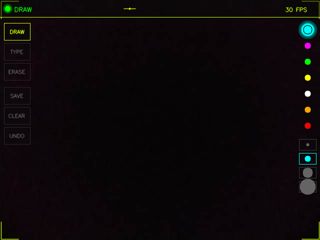
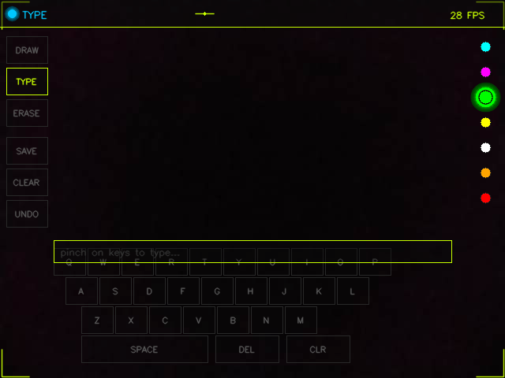

# 🖐️ VR-tracking

> gesture controlled hand tracking with drawing,virtual keyboard and hud overlay

[](https://python.org)
[](https://mediapipe.dev)
[](https://opencv.org)
[](LICENSE)

---

## 📸 screenshots

| draw mode | type mode |
|:---------:|:---------:|
|  |  |

---

## ⚡ what it does

- opens camera,auto detects webcam or droidcam or any source
- tracks both hands in realtime with hud overlay
- draw in the air with ur index finger
- virtual qwerty keyboard,pinch on keys to type
- eraser mode to remove stuff
- 7 colors and 4 brush sizes,select with pinch gesture
- save,clear,undo all with hand gestures
- no keyboard needed everything is gesture controlled

---

## 🛠️ setup

```bash
# 1. clone
git clone https://github.com/Quantum5hadow/VR-tracking.git
cd VR-tracking

# 2. install dependencies
pip install -r requirements.txt

# 3. download hand tracking model
# grab from: https://storage.googleapis.com/mediapipe-models/hand_landmarker/hand_landmarker/float16/latest/hand_landmarker.task
# save as hand_landmarker.task in project folder

# 4. run
python main.py
```

> **note:** requires python 3.12 (mediapipe doesnt support 3.13 yet)

---

## 🎮 gesture controls

| gesture | action |
|---------|--------|
| ☝️ index finger up | draw / interact |
| ✌️ index + middle | move without drawing |
| 🤏 pinch (thumb + index) | select buttons,colors,keys |
| 👊 hover over button | highlights before pinch |

---

## 📋 modes

| mode | what it does |
|------|-------------|
| **DRAW** | index finger draws on screen |
| **TYPE** | qwerty keyboard pops up,pinch keys to type |
| **ERASE** | finger becomes eraser |

---

## 🖥️ ui panels

```
┌──────────────────────────────────────────────┐
│ ● DRAW                            28 FPS     │  ← top bar
├────┬─────────────────────────────────┬───────┤
│DRAW│                                 │  ● ●  │
│TYPE│        camera feed              │  ● ●  │  ← color
│ERAS│        + hand tracking          │  ● ●  │     palette
│────│        + drawing canvas         │  ●    │
│SAVE│                                 │───────│
│CLR │                                 │  ○ ○  │  ← brush
│UNDO│                                 │  ○ ○  │     sizes
├────┴─────────────────────────────────┴───────┤
│  [Q][W][E][R][T][Y][U][I][O][P]              │  ← keyboard
│   [A][S][D][F][G][H][J][K][L]                │     (TYPE
│    [Z][X][C][V][B][N][M]                     │      mode)
│  [  SPACE  ][DEL][CLR]                       │
└──────────────────────────────────────────────┘
```

---

## 📁 files

| file | what it does |
|------|-------------|
| `tracker.py` | hand detection,finger state,pinch detection |
| `hud.py` | ui,buttons,keyboard,glow effects,watermark |
| `main.py` | camera loop,gesture handling,drawing logic |

---

## 🔧 tech stack

| lib | version | used for |
|-----|---------|----------|
| mediapipe | 0.10.32 | hand landmark detection (21 points) |
| opencv-python | 4.13 | camera,drawing,display,image processing |
| numpy | 2.4 | canvas array,masking,pixel operations |

---

## 🗺️ coming soon

- [ ] web version using tensorflow.js
- [ ] mouse cursor control mode
- [ ] face tracking
- [ ] more gesture controls
- [ ] better hud animations

---

## 📄 license

MIT — do whatever u want with it

---

<p align="center">
  made by <a href="https://github.com/Quantum5hadow">Quantum5hadow</a><br>
  ⭐ star this repo if u like it
</p>
